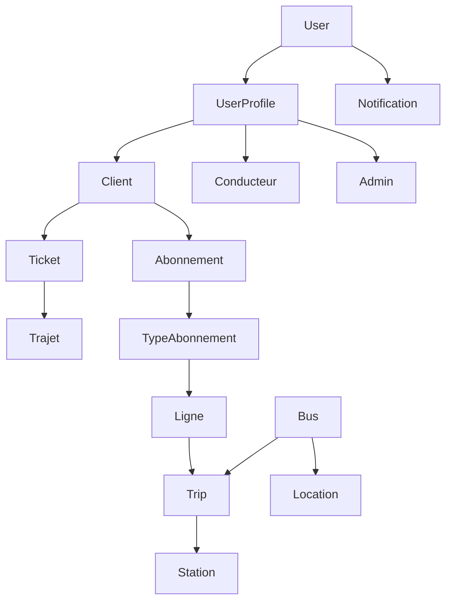
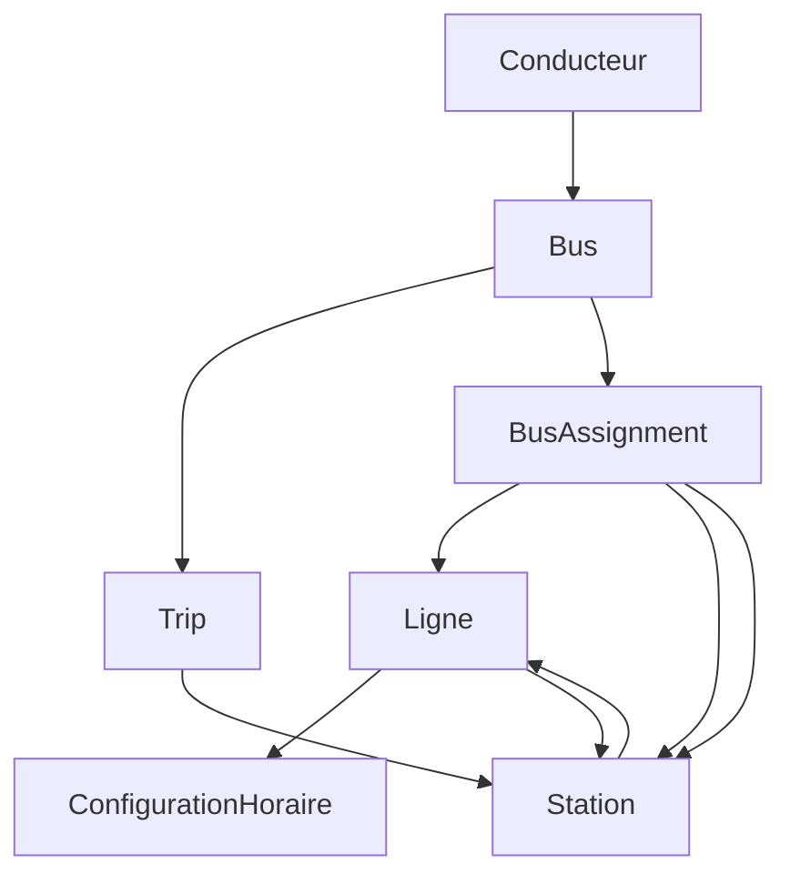
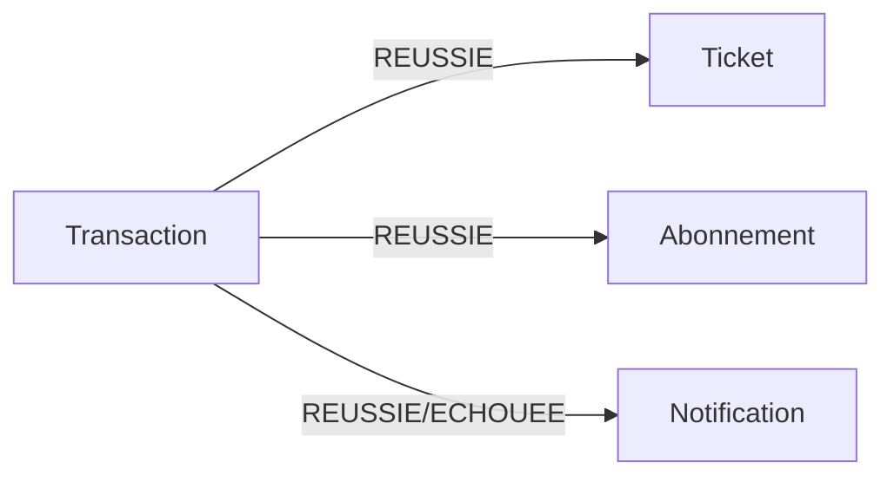
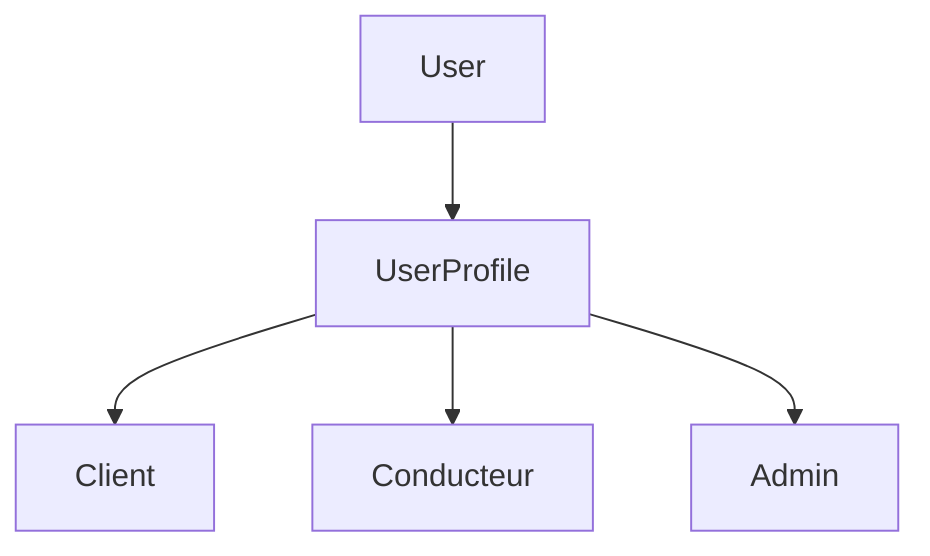
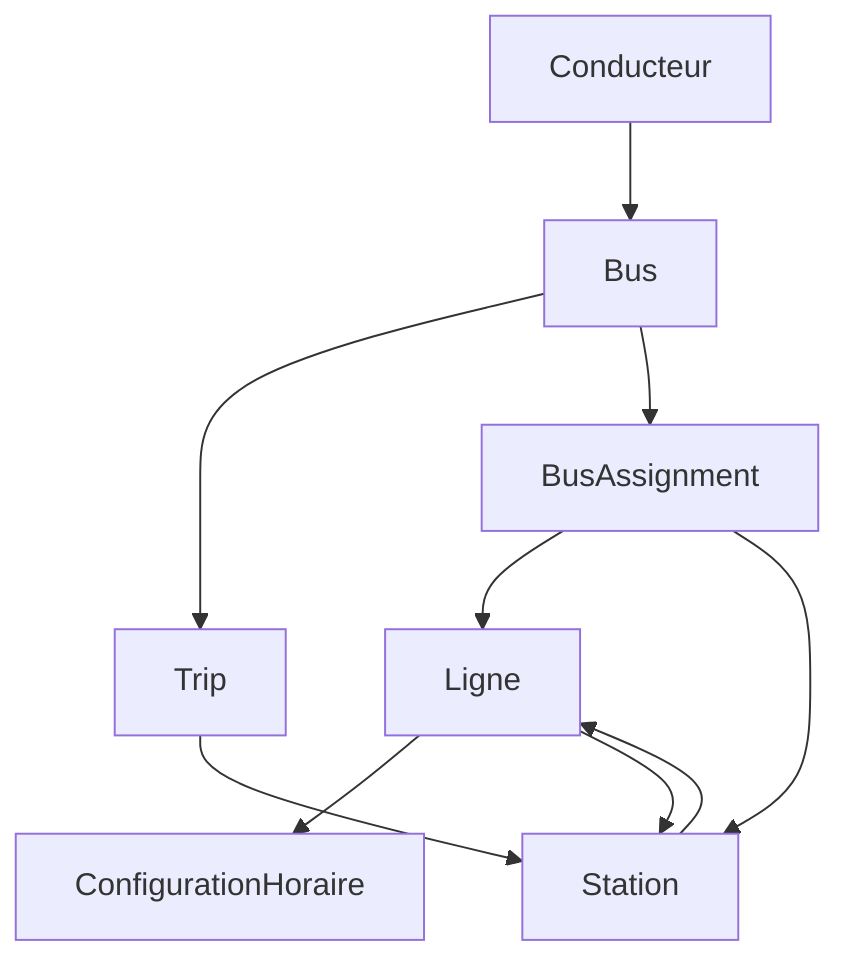
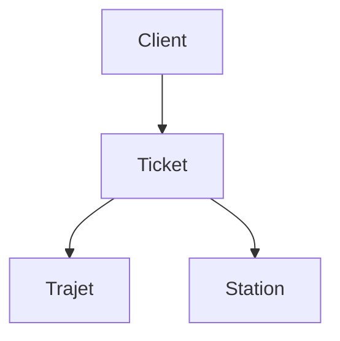
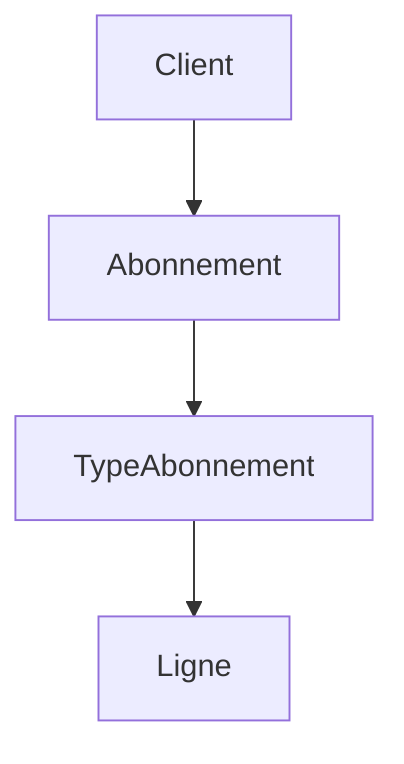
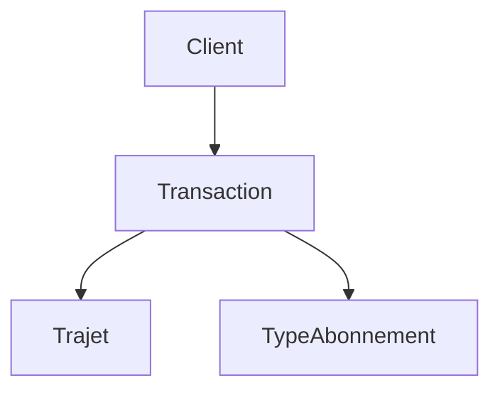
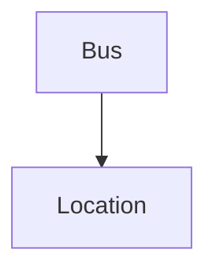
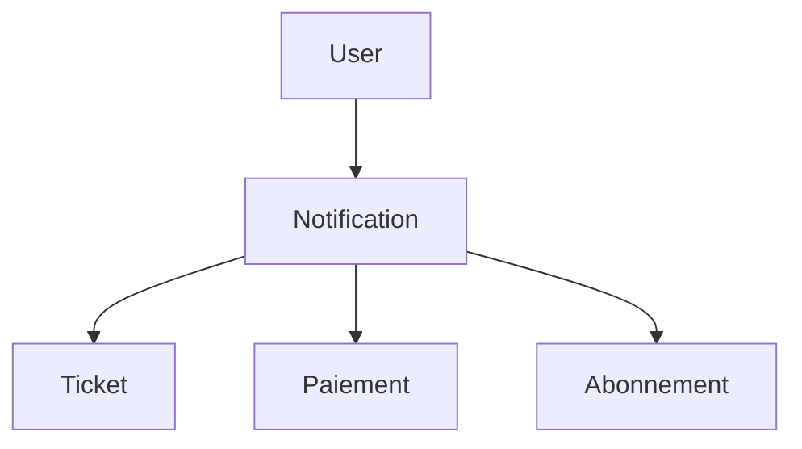

# Knowledge Graph - Spec Complete (toutes relations et regles)

Devise: MAD
Trajet = Trip (execution a une date/heure).

Ce document regroupe:
- toutes les entites utiles du projet
- toutes les relations (intra-service et inter-services)
- toutes les regles metier visibles dans le code
- des requetes Cypher pour creer chaque relation

## 1) Sources de donnees (microservices)

Auth Service
- Utilisateur technique (login/email/role/verification)

User Service
- Profils utilisateurs: Client, Conducteur, Admin

Trajet Service
- Bus, Ligne, Station, Trip, PassageStation, LigneStation
- Assignation bus <-> ligne, bus <-> conducteur
- Configuration horaire par ligne

Paiement Service
- Transaction, type de paiement, type de service

Ticket Service
- Ticket + statuts + creation/validation/annulation/remboursement

Abonnement Service
- Abonnement + type abonnement + lignes autorisees

Geolocalisation Service
- Location (position bus)

Notification Service
- Notification + types (payment/ticket/subscription)

## 2) Entites (champs principaux)

Utilisateur (Auth Service)
- user_id, uuid, username, email, role, enabled, date_creation

UserProfile (User Service)
- profile_id, uuid, email, username, role, date_creation

ClientProfile
- nom, prenom, telephone, statut_client, date_inscription

ConducteurProfile
- nom, prenom, telephone, numero_permis, statut_conducteur, date_embauche

AdminProfile
- (heritage direct de UserProfile)

Bus
- bus_id, numero_immatriculation, capacite, modele, active
- latitude_actuelle, longitude_actuelle, metre_avant_arret

Ligne
- ligne_id, numero, nom, prix_standard, vitesse_standard_kmh, distance_totale_km, active

Station
- station_id, nom, latitude, longitude, capacite, active

LigneStation (pivot)
- id, ligne_id, station_id, ordre, distance_cumulee_km

Trip (Trajet)
- trajet_id, numero_trip, date_trip, heure_depart, est_aller, statut, tickets_vendus
- ligne_id, bus_id
- prix_montant = prix_standard, prix_devise = MAD

PassageStation (pivot)
- id, trip_id, station_id, ordre, heure_prevu, heure_reelle, heure_estimee, retard_minutes, confirme

BusAssignment (bus <-> ligne + stations)
- id, bus_id, ligne_id, station_depart_id, station_arrivee_id
- heure_depart_aller, heure_depart_retour, active, commence_a_station_depart

AssignationBusConducteur (bus <-> conducteur)
- id, bus_id, conducteur_id, date_debut, date_fin, active

ConfigurationHoraire
- id, ligne_id, heure_debut, heure_fin, frequence_minutes
- duree_aller_minutes, duree_retour_minutes, temps_pause_minutes, temps_arret_minutes
- nombre_bus, nombre_bus_depart, nombre_bus_destination, active

Transaction (Paiement)
- transaction_id, reference, client_id, montant, devise, type_paiement
- statut_transaction, date_transaction, type_service, reference_service
- description, motif_echec
Note: dans les requetes Cypher, la transaction est labelisee :Paiement.

InfoPaiementCarte (embeddable)
- numero_carte, nom_titulaire, date_expiration, cvv

Ticket
- ticket_id, numero_ticket, client_id, trip_id, numero_trip
- ligne_id, nom_ligne, station_depart_id, nom_station_depart
- station_finale_id, nom_station_finale
- date_achat, prix, statut_ticket, transaction_id

Abonnement
- abonnement_id, numero_abonnement, client_id, type_abonnement_id
- date_debut, date_fin, date_achat, statut_abonnement
- montant_paye, transaction_id, lignes_autorisees, zone_geographique

TypeAbonnement
- type_abonnement_id, code, nom, description, prix, duree_jours, actif

LigneAutorisee (pivot)
- id, type_abonnement_id, ligne_id, nom_ligne

Location (Geolocalisation)
- location_id, bus_id, latitude, longitude, created_at

Notification
- id, user_id, type, title, message, is_read, created_at
- payment_id, amount, ticket_id, subscription_id

## 3) Relations (toutes)

Identite / profils
- UserProfile IS_A ClientProfile / ConducteurProfile / AdminProfile

Trajet Service
- Bus -> Trip (1-N)
- Ligne -> Trip (1-N)
- Ligne -> ConfigurationHoraire (1-1)
- Ligne -> Station (N-N via LigneStation, ordre)
- Trip -> Station (N-N via PassageStation, ordre, horaires)
- Bus -> BusAssignment (1-N)
- BusAssignment -> Ligne (N-1)
- BusAssignment -> Station (depart / arrivee)
- Bus -> AssignationBusConducteur (1-N)
- AssignationBusConducteur -> Conducteur (by conducteur_id)

Ticket Service
- Client -> Ticket (1-N, achat)
- Ticket -> Trip (N-1)
- Ticket -> Station (depart/arrivee, references)
- Ticket -> Transaction (N-1)

Abonnement Service
- Client -> Abonnement (1-N)
- Abonnement -> TypeAbonnement (N-1)
- TypeAbonnement -> LigneAutorisee (1-N)
- LigneAutorisee -> Ligne (by ligne_id)

Paiement Service
- Client -> Transaction (1-N)
- Transaction -> Trip (reference_service quand ACHAT_TICKET)
- Transaction -> TypeAbonnement (reference_service quand ABONNEMENT)

Geolocalisation Service
- Bus -> Location (1-N)

Notification Service
- User -> Notification (1-N)
- Notification -> Ticket (ticket_id optionnel)
- Notification -> Transaction (payment_id optionnel)
- Notification -> Abonnement (subscription_id optionnel)

Events / integration (RabbitMQ)
- Transaction REUSSIE -> Ticket cree + TicketEvent(ISSUED)
- Transaction REUSSIE -> Abonnement cree + AbonnementEvent(ISSUED)
- Transaction REUSSIE/ECHOUEE -> Notification de paiement
- TicketEvent(ISSUED/VALIDATED) -> Notification de ticket
- AbonnementEvent(ISSUED) -> Notification abonnement
- SubscriptionEvent(RENEWED/EXPIRED) -> Notification abonnement
- RefundEvent -> Ticket rembourse + event publie

## 4) Regles metier (toutes)

Trip
- demarrer: autorise uniquement si statut = PLANIFIE, passe a EN_COURS
- terminer: autorise uniquement si statut = EN_COURS, passe a TERMINE
- annuler: interdit si statut = TERMINE
- reserver_place: autorise si tickets_vendus < bus.capacite, sinon erreur

PassageStation
- confirmer: interdit si deja confirme
- retard_minutes = difference entre heure_prevu et heure_reelle
- heure_estimee = heure_reelle si confirme, sinon heure_prevu + retard_minutes
- lors d une confirmation, le retard est propage aux stations suivantes non confirmees

Trip recherche
- un trip correspond si station_depart et station_arrivee existent et ordre_depart < ordre_arrivee

Abonnement
- estValide: statut = ACTIF et date_fin >= aujourd hui
- estExpire: date_fin < aujourd hui
- renouveler: autorise si ACTIF ou EXPIRE
- annuler: autorise uniquement si ACTIF
- verification expirations: tache planifiee, passe ACTIF -> EXPIRE

Ticket
- creer depuis paiement: statut = ACHETE, prix = montant paiement
- valider: autorise uniquement si statut = ACHETE, passe a UTILISE
- annuler: autorise uniquement si statut = ACHETE, passe a ANNULE
- rembourser: autorise uniquement si statut = ANNULE, passe a REMBOURSE

Transaction
- onCreate: reference PAY-xxxx, date_transaction auto, devise = MAD
- statuts: EN_ATTENTE, REUSSIE, ECHOUEE

Notification
- paiement REUSSIE -> notification PAYMENT success
- paiement ECHOUEE -> notification PAYMENT failed
- ticket ISSUED/VALIDATED -> notification TICKET
- abonnement ISSUED/RENEWED/EXPIRED -> notification SUBSCRIPTION

Geolocalisation
- a chaque demarrage de trip: position bus mise a jour sur station depart
- a chaque confirmation de passage: position bus mise a jour sur station confirmee

## 5) Requetes Cypher - creation des relations

Notation: les noeuds sont supposes deja crees.

### Profils

```cypher
MATCH (p:UserProfile {uuid: $uuid})
MATCH (c:Client {uuid: $uuid})
MERGE (p)-[:IS_A]->(c)
```

```cypher
MATCH (p:UserProfile {uuid: $uuid})
MATCH (d:Conducteur {uuid: $uuid})
MERGE (p)-[:IS_A]->(d)
```

```cypher
MATCH (p:UserProfile {uuid: $uuid})
MATCH (a:Admin {uuid: $uuid})
MERGE (p)-[:IS_A]->(a)
```

### Bus -> Trip

```cypher
MATCH (b:Bus {bus_id: $busId})
MATCH (t:Trajet {trajet_id: $trajetId})
MERGE (b)-[:AFFECTE_A]->(t)
```

### Ligne -> Trip

```cypher
MATCH (l:Ligne {ligne_id: $ligneId})
MATCH (t:Trajet {trajet_id: $trajetId})
MERGE (l)-[:PLANIFIE]->(t)
```

### Ligne -> ConfigurationHoraire

```cypher
MATCH (l:Ligne {ligne_id: $ligneId})
MATCH (c:ConfigurationHoraire {config_id: $configId})
MERGE (l)-[:A_CONFIG]->(c)
```

### Ligne -> Station (LigneStation)

```cypher
MATCH (l:Ligne {ligne_id: $ligneId})
MATCH (s:Station {station_id: $stationId})
MERGE (l)-[r:PASSE_PAR_LIGNE]->(s)
SET r.ordre = $ordre,
    r.distance_cumulee_km = $distanceCumuleeKm
```

### Trip -> Station (PassageStation)

```cypher
MATCH (t:Trajet {trajet_id: $trajetId})
MATCH (s:Station {station_id: $stationId})
MERGE (t)-[r:PASSE_PAR]->(s)
SET r.ordre = $ordre,
    r.heure_prevu = $heurePrevu,
    r.heure_reelle = $heureReelle,
    r.heure_estimee = $heureEstimee,
    r.retard_minutes = $retardMinutes,
    r.confirme = $confirme
```

### Trip -> Station (PART_DE, ARRIVE_A)

```cypher
MATCH (t:Trajet {trajet_id: $trajetId})-[p:PASSE_PAR]->(s:Station)
WITH t, p, s ORDER BY p.ordre ASC
WITH t, collect({s:s, p:p})[0] AS first
MERGE (t)-[r:PART_DE]->(first.s)
SET r.ordre = first.p.ordre,
    r.heure_prevu = first.p.heure_prevu
```

```cypher
MATCH (t:Trajet {trajet_id: $trajetId})-[p:PASSE_PAR]->(s:Station)
WITH t, p, s ORDER BY p.ordre DESC
WITH t, collect({s:s, p:p})[0] AS last
MERGE (t)-[r:ARRIVE_A]->(last.s)
SET r.ordre = last.p.ordre,
    r.heure_estimee = last.p.heure_estimee
```

### BusAssignment

```cypher
MATCH (b:Bus {bus_id: $busId})
MATCH (l:Ligne {ligne_id: $ligneId})
MERGE (b)-[r:ASSIGNE_LIGNE]->(l)
SET r.heure_depart_aller = $heureDepartAller,
    r.heure_depart_retour = $heureDepartRetour,
    r.active = $active,
    r.commence_a_station_depart = $commenceAStationDepart
```

```cypher
MATCH (b:Bus {bus_id: $busId})
MATCH (s:Station {station_id: $stationDepartId})
MERGE (b)-[r:COMMENCE_A]->(s)
```

```cypher
MATCH (b:Bus {bus_id: $busId})
MATCH (s:Station {station_id: $stationArriveeId})
MERGE (b)-[r:TERMINE_A]->(s)
```

### AssignationBusConducteur

```cypher
MATCH (d:Conducteur {conducteur_id: $conducteurId})
MATCH (b:Bus {bus_id: $busId})
MERGE (d)-[r:CONDUIT]->(b)
SET r.date_debut = $dateDebut,
    r.date_fin = $dateFin,
    r.active = $active
```

### Client -> Ticket

```cypher
MATCH (c:Client {client_id: $clientId})
MATCH (t:Ticket {ticket_id: $ticketId})
MERGE (c)-[r:ACHETE]->(t)
SET r.date_achat = $dateAchat
```

### Ticket -> Trajet

```cypher
MATCH (t:Ticket {ticket_id: $ticketId})
MATCH (tr:Trajet {trajet_id: $trajetId})
MERGE (t)-[r:VALIDE_POUR]->(tr)
SET r.date_achat = $dateAchat
```

### Ticket -> Station (depart/arrivee)

```cypher
MATCH (t:Ticket {ticket_id: $ticketId})
MATCH (s:Station {station_id: $stationDepartId})
MERGE (t)-[:DEPART_DE]->(s)
```

```cypher
MATCH (t:Ticket {ticket_id: $ticketId})
MATCH (s:Station {station_id: $stationArriveeId})
MERGE (t)-[:ARRIVE_A]->(s)
```

### Client -> Abonnement

```cypher
MATCH (c:Client {client_id: $clientId})
MATCH (a:Abonnement {abonnement_id: $abonnementId})
MERGE (c)-[r:SOUSCRIT]->(a)
SET r.date_achat = $dateAchat
```

### Abonnement -> TypeAbonnement

```cypher
MATCH (a:Abonnement {abonnement_id: $abonnementId})
MATCH (t:TypeAbonnement {type_abonnement_id: $typeAbonnementId})
MERGE (a)-[:DE_TYPE]->(t)
```

### TypeAbonnement -> LigneAutorisee -> Ligne

```cypher
MATCH (t:TypeAbonnement {type_abonnement_id: $typeAbonnementId})
MATCH (l:Ligne {ligne_id: $ligneId})
MERGE (t)-[r:AUTORISE_LIGNE]->(l)
SET r.nom_ligne = $nomLigne
```

### Abonnement -> Trajet (validation)

```cypher
MATCH (a:Abonnement {abonnement_id: $abonnementId})
MATCH (t:Trajet {trajet_id: $trajetId})
WHERE $ligneId IN a.lignes_autorisees
  AND a.statut = "ACTIF"
  AND a.date_fin >= date()
MERGE (a)-[r:VALIDE_POUR]->(t)
SET r.ligne_id = $ligneId,
    r.zone_geographique = a.zone_geographique
```

### Transaction -> Client

```cypher
MATCH (c:Client {client_id: $clientId})
MATCH (p:Paiement {transaction_id: $transactionId})
MERGE (c)-[:EFFECTUE]->(p)
```

### Transaction -> Trip / TypeAbonnement

```cypher
MATCH (p:Paiement {transaction_id: $transactionId})
MATCH (t:Trajet {trajet_id: $trajetId})
MERGE (p)-[:PAYE_TRIP]->(t)
```

```cypher
MATCH (p:Paiement {transaction_id: $transactionId})
MATCH (ta:TypeAbonnement {type_abonnement_id: $typeAbonnementId})
MERGE (p)-[:PAYE_ABONNEMENT]->(ta)
```

### Bus -> Location

```cypher
MATCH (b:Bus {bus_id: $busId})
MATCH (l:Location {location_id: $locationId})
MERGE (b)-[:A_POSITION]->(l)
```

### User -> Notification

```cypher
MATCH (u:User {user_id: $userId})
MATCH (n:Notification {id: $notificationId})
MERGE (u)-[:RECOIT]->(n)
```

### Notification -> Ticket / Transaction / Abonnement

```cypher
MATCH (n:Notification {id: $notificationId})
MATCH (t:Ticket {ticket_id: $ticketId})
MERGE (n)-[:CONCERNE_TICKET]->(t)
```

```cypher
MATCH (n:Notification {id: $notificationId})
MATCH (p:Paiement {transaction_id: $transactionId})
MERGE (n)-[:CONCERNE_PAIEMENT]->(p)
```

```cypher
MATCH (n:Notification {id: $notificationId})
MATCH (a:Abonnement {abonnement_id: $abonnementId})
MERGE (n)-[:CONCERNE_ABONNEMENT]->(a)
```

## 6) Diagrammes simples

### Vue d ensemble (haut niveau)



### Trajet Service (detail)



### Paiement -> Ticket / Abonnement / Notification



## 7) Requetes Cypher - lecture (reporting)

### Trips disponibles entre deux stations (tri prix)

```cypher
MATCH (s1:Station {station_id: $stationDepartId})<-[:PASSE_PAR]-(t:Trajet)-[:PASSE_PAR]->(s2:Station {station_id: $stationArriveeId})
MATCH (t)-[p1:PASSE_PAR]->(s1)
MATCH (t)-[p2:PASSE_PAR]->(s2)
WHERE p1.ordre < p2.ordre
RETURN t
ORDER BY t.prix_montant ASC
```

### Trips d un client via tickets

```cypher
MATCH (c:Client {client_id: $clientId})-[:ACHETE]->(tk:Ticket)-[:VALIDE_POUR]->(t:Trajet)
RETURN tk, t
ORDER BY tk.date_achat DESC
```

### Tickets d un client

```cypher
MATCH (c:Client {client_id: $clientId})-[:ACHETE]->(tk:Ticket)
RETURN tk
ORDER BY tk.date_achat DESC
```

### Abonnements actifs d un client

```cypher
MATCH (c:Client {client_id: $clientId})-[:SOUSCRIT]->(a:Abonnement)
WHERE a.statut = "ACTIF" AND a.date_fin >= date()
RETURN a
ORDER BY a.date_fin ASC
```

### Trajets valides pour un abonnement

```cypher
MATCH (a:Abonnement {abonnement_id: $abonnementId})-[:VALIDE_POUR]->(t:Trajet)
RETURN t
ORDER BY t.date_trip, t.heure_depart
```

### Stations d un trip (ordre)

```cypher
MATCH (t:Trajet {trajet_id: $trajetId})-[p:PASSE_PAR]->(s:Station)
RETURN s, p
ORDER BY p.ordre ASC
```

### Trips d une ligne

```cypher
MATCH (l:Ligne {ligne_id: $ligneId})-[:PLANIFIE]->(t:Trajet)
RETURN t
ORDER BY t.date_trip, t.heure_depart
```

### Bus et ses trips (jour)

```cypher
MATCH (b:Bus {bus_id: $busId})-[:AFFECTE_A]->(t:Trajet)
WHERE t.date_trip = date($date)
RETURN t
ORDER BY t.heure_depart
```

### Conducteur et bus actif (assignation en cours)

```cypher
MATCH (d:Conducteur {conducteur_id: $conducteurId})-[r:CONDUIT]->(b:Bus)
WHERE r.active = true AND date() >= r.date_debut AND date() <= r.date_fin
RETURN b, r
```

### Historique positions d un bus

```cypher
MATCH (b:Bus {bus_id: $busId})-[:A_POSITION]->(l:Location)
RETURN l
ORDER BY l.created_at DESC
```

### Notifications d un utilisateur

```cypher
MATCH (u:User {user_id: $userId})-[:RECOIT]->(n:Notification)
RETURN n
ORDER BY n.created_at DESC
```

### Paiements d un client

```cypher
MATCH (c:Client {client_id: $clientId})-[:EFFECTUE]->(p:Paiement)
RETURN p
ORDER BY p.date_transaction DESC
```

## 8) Diagrammes par service (details)

### User + Auth



### Trajet Service



### Ticket Service



### Abonnement Service



### Paiement Service



### Geolocalisation Service



### Notification Service


